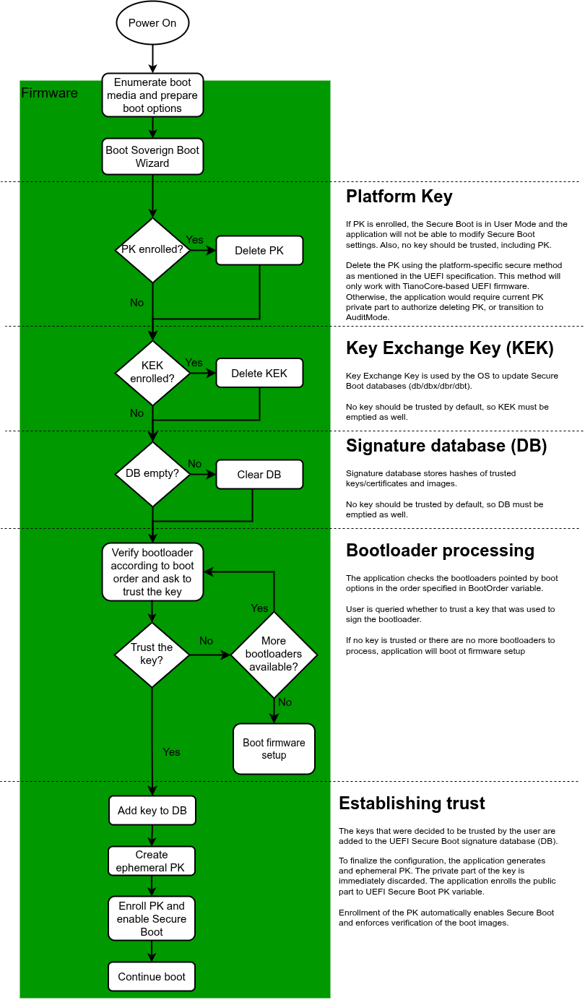
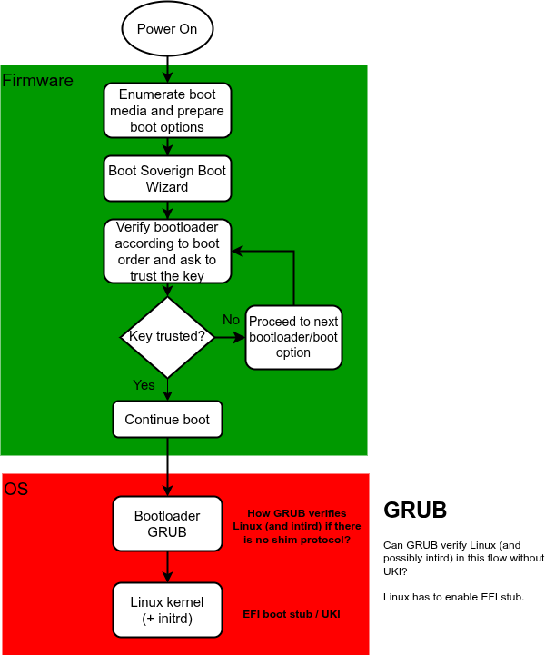
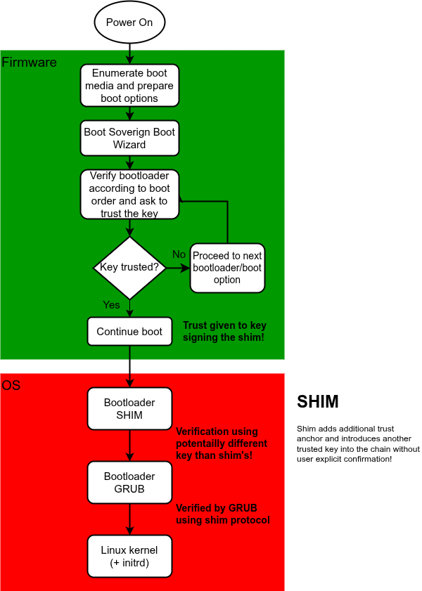
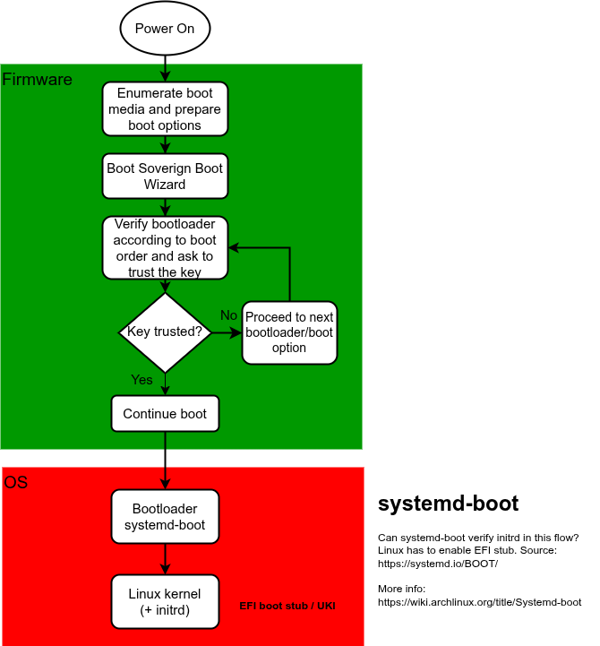
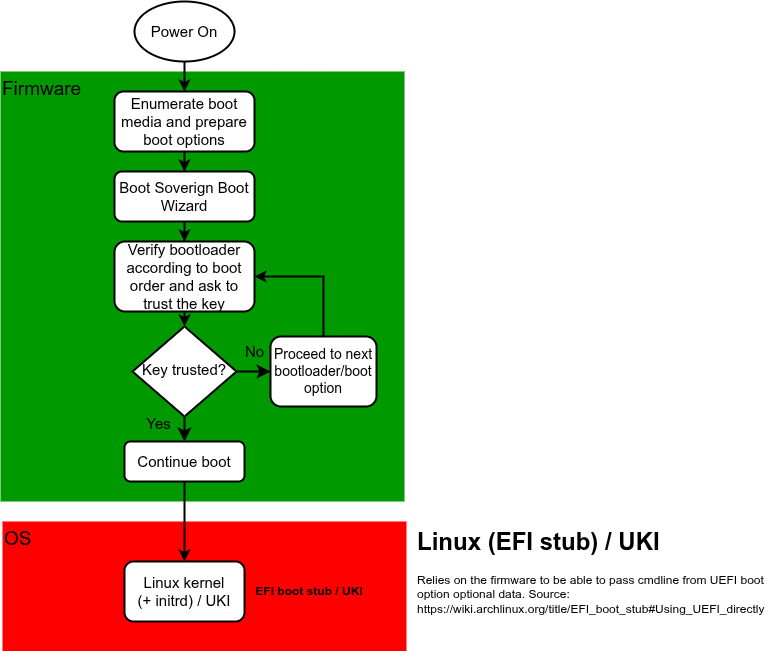

# Soverign Boot Provisioning Wizard

## 1. Introduction

This document specifies the behavior and architecture of a UEFI application
designed to guide end users through the provisioning of UEFI Secure Boot. The
objective is to offer a user-controllable mechanism for managing platform
trust relationships and establishing UEFI Secure Boot infrastructure, with a
primary focus on transparency, informed consent, and usability.

Unlike traditional firmware interfaces, which expose UEFI Secure Boot as a
collection of loosely connected toggleable settings and unmanaged certificate
stores, this application presents a coherent, wizard-like experience. Its
purpose is to make the process of reviewing and enrolling platform keys
intuitive for users who are not security experts.

## 2. Application Design Overview

The Soverign Boot Provisioning Wizard is a standalone UEFI application
executed either from a system firmware image. It operates in the pre-boot UEFI
environment, executing on first boot, or on `EFI_BOOT_MODE` set to
`BOOT_WITH_DEFAULT_SETTINGS` or `BOOT_WITH_MFG_MODE_SETTINGS`, or as a
fallback mechanism when UEFI Secure Boot verification fails on subsequent
boots.

Upon launch, the application initializes required protocols and services,
including but not limited to:

* `EFI_SIMPLE_FILE_SYSTEM_PROTOCOL` for accessing ESPs
* `EFI_LOADED_IMAGE_PROTOCOL` for self-inspection
* `EFI_VARIABLE_SERVICES_PROTOCOL` for interaction with UEFI Secure Boot
  variables and boot option configuration
* `EFI_SECURITY_ARCH_PROTOCOL`/`EFI_SECURITY2_ARCH_PROTOCOL` for verifying
  images via `EFI_BOOT_SERVICES.LoadImage()`

The application executes in several stages, forming a wizard workflow. These
stages include environment scanning, key discovery, signature validation,
and key enrollment.



On first launch or during boot with default settings, the application ensures
that UEFI Secure Boot is in setup mode, and if not it deletes current Platform
Key `PK` using the platform-specific method. While in Setup Mode, the
application removes Key Exchange Keys and trusted signature database `db` to
guarantee a clean state for establishing trust.

In the next phase the application analyzes boot options, prompts the user
whether to trust they key used to sign the image in the boot option.

Once trusted key database is configured, the application creates ephemeral
Platform Key `PK`, discards its private part, and enrolls the public part into
`PK` variable to activate UEFI Secure Boot.

Only after the UEFI Secure Boot environment is provisioned and a Platform Key
is set does the application default to the interactive menu interface on
subsequent invocations. This ensures a streamlined initial experience focused
on system provisioning, while providing full transparency and control
afterward.

The interactive menu interface is designed to provide detailed view on current
system environment:

- Current boot options and their:
  - Verification status
  - Key fingerprint if the image is signed
  - Key trust status
- Current trusted key database

As well as options for Soverign Boot reprovisioning.

## 3. Operational Phases

### 3.1 Environment Initialization

The application can only run before `EFI_BOOT_SERVICES.ExitBootServices()` has
been called.

The application locates all necessary protocols for its operation:

- HOB list (for `EFI_BOOT_MODE` information)
- Boot Services (for `LoadImage` and `StartImage` and possibly other API)
- Runtime Services (for Variable services and possibly other API)
- crypto libraries (for parsing the certificates and signature verification in
  the images)

The application also consults the `Boot####` and `BootOrder` variables to
determine the available boot options and priority of bootloader processing.

If the application is run after initial provisioning, it will read out current
`PK` and `db` and parse its content.

### 3.3 Bootloader Identification and Verification

The application will parse the images of the bootloaders to obtain information
about the signatures. The application will additionally validate bootloaders
using `EFI_BOOT_SERVICES.LoadImage()`. Bootloaders that pass signature checks
using are listed for potential trust decisions. For images with unknown but
verifiable keys, the application initiates a trust prompt.

The priority of bootloader processing is determined by `BootOrder` variable
prepared by the firmware before launching the application.

The information about the bootloader should include:

* The EFI image device path
* Status of image verification
* Associated certificates/keys fingerprints

### 3.4 Trust Decision and Key Enrollment

The application parses the certificates embedded inside the PE/COFF image
format as described in the UEFI specification. For each newly encountered
signing key fingerprint/certificate discovered during bootloader verification,
the application prompts the user whether to trust the key/certificate. The
prompt must include the key/certificate fingerprint. The prompt may display
additional information:

* Certificate subject (if available)
* Certificate issuer fields (if available)

With explicit user consent and double confirmation, the application enrolls
the certificate fingerprint into the trusted signature database `db` using
`SetVariable()`. Since the application operates in UEFI Secure Boot Setup Mode
at this point, authenticated write access is not required.

If the bootloader has more than one signature, the application will prompt to
trust each unique key found in the image, for which trust decision was not yet
made. The application will stop prompting on the first key/certificate that
the user decides to trust for given bootloader.

If the bootloader is signed only by Microsoft keys/certificates the trust
prompt is deferred for later and the application attemps to process next
bootloader if available. Trust prompt for Microsoft keys/certificates has the
lowest priority (ignoring `BootOrder`) in such case. Once all other options
are exhausted, the application will prompt to trust the Microsoft
keys/certificates if any bootloaders signed by them are found.

The application may continue booting the currently processed bootloader or
proceed to check next bootloader and continue with trust prompts until all
options are exhausted or user decides to continue booting.

Only the `db` (permitted image signers) may be updated during this phase. No
changes to `PK` are performed until the end of the provisioning workflow. This
restriction ensures that the platform's trust anchors and ownership state are
not altered prematurely.

At the end of the provisioning workflow (once trusted key database is
configured), the application creates ephemeral Platform Key `PK`, discards its
private part, and enrolls the public part into `PK` variable. Enrolling the
`PK` while UEFI Secure Boot is in Setup Mode will cause the firmware to
transition the UEFI Secure Boot to User Mode and activate enforced image
verification (enable UEFI Secure Boot).

### 3.5 Boot Option Modifications

When trusted key database is configured. `PK` is enrolled and UEFI Secure Boot
is enabled, the application will proceed with booting the selected option.
However, if user chose to trust a key/certificate of an option that was not the
top priority in the `BootOrder` variable, the application will update the
`BootOrder` variable to ensure the trusted bootloader is prioritized
appropriately.

When the application is not launched for the first time, it is in the
interactive menu mode. The menu may offer a possibility to add new options
from discovered bootloaders and modify bootorder if the user decides to extend
the trusted key database by new keys/certificate or bootloaders.

## 4. Security Model

The application adheres to the security model defined in the UEFI Secure Boot
architecture. The application is designed with adhering to the following
rules:

* No key is trusted without explicit user action. The rule applies only to the
  bootloader executed directly by the application. If the bootloader
  introduces another key into the trust chain, it is out of scope of the
  application.
* Bootloaders are not executed unless validated against an enrolled key and
  authorized by the user.
* The application is only responsible for continuing the chain of trust by
  verifying the bootloader directly executed by the application. Further chain
  of trust continuation is the bootloader's responsibility and is out of scope
  of the application.
* The application is not responsible for protecting UEFI Secure Boot
  configuration. Unauthorized modifications to Secure Boot via firmware setup
  should be prevent with firmware setup password feature.

## 5. Integration Considerations

This application is a standard UEFI application and must be deployed as an
executable PE32+ image conforming to the UEFI application format. It shall
reside integrated into the firmware volume to ensure it is always available.

Firmware implementations are encouraged to invoke the wizard:

* On first boot
* When `EFI_BOOT_MODE == BOOT_WITH_DEFAULT_SETTINGS`
* When UEFI Secure Boot verification fails of the previously trusted
  bootloader
* By Boot Manager when none of the boot options work. If there are no boot
  options on disks, then the firmware should fall back to firmware setup or
  any other platform-specific fallback boot option.
* Manually by the firmware through the firmware setup menu if user requests to
  do so.

The firmware setup menu must also offer an option to disable/omit the Soverign
Boot Wizard in the boot flow to restore regular firmware behavior.

## 6. User Interface Design

### 6.1 Wizard Mode

This is the default mode of operation during the first launch of application
or when the system has restored default settings. The primary focus of this
mode is to provide straightforward and easy experience of provisioning UEFI
Secure Boot feature and establishing trust relationships between the user and
the system.

### 6.1.1 Welcome window

```
+------------------------------------------------------------+
|            Soverign Boot Provisioning Wizard               |
+------------------------------------------------------------+
|   This system has been booted for the first time or has    |
|   restored default settings. The wizard will assist in     |
|   UEFI Secure Boot provisioning and trusted key database   |
|   configuration.                                           |
|                                                            |
|   Boot0001:  Fedora (on SATA SSD #1 ESP)                   |
|                                                            |
|   Key Fingerprint (SHA-256):                               |
|   AB34EF...                                                |
+------------------------------------------------------------+
|   A new bootloader key has been detected.                  |
|   Do you want to trust this key and continue booting?      |
+------------------------------------------------------------+
| > Do NOT trust and proceed to the next key/bootloader      |
| > Trust this key and Boot                                  |
| > Trust this key and proceed to the next key/bootloader    |
| > Show Key Details                                         |
+------------------------------------------------------------+
| > Reboot                                                   |
+------------------------------------------------------------+
|   Use ↑↓ to navigate.                                      |
|   Use Enter to confirm selection.                          |
|   Use ESC to go back to previous menu.                     |
+------------------------------------------------------------+
```

### 6.1.2 Key trust Prompt

When user decides to trust the key, the application must confirm user's
decision with second prompt:

+------------------------------------------------------------+
|       Confirm Trust Decision for Key Fingerprint           |
+------------------------------------------------------------+
|                                                            |
|   Fingerprint (SHA-256):                                   |
|   AB34EF...                                                |
|                                                            |
|   Are you sure you want to trust this key?                 |
|   This will allow the system to boot and save the key.     |
|                                                            |
+------------------------------------------------------------+
|                                                            |
| > Yes, Trust This Key                                      |
| > No, Go Back                                              |
|                                                            |
+------------------------------------------------------------+
|   Use ↑↓ to navigate.                                      |
|   Use Enter to confirm selection.                          |
|   Use ESC to go back to previous menu.                     |
+------------------------------------------------------------+

### 6.2 Interactive Mode

The Interactive Mode is an alternative mode of operation of the application
once the Soverign Boot has already been configured on the system. It omits
wizard-like behavior and presents a menu windows allowing for adjustment of
the Soverign Boot. This mode of operation is much information-rich and offer
flexible management of trusted key database.

#### 6.2.1 Interactive Mode Main Menu

```
+------------------------------------------------------------+
|             Soverign Boot Provisioning Wizard              |
+------------------------------------------------------------+
|                                                            |
| > Modify Trusted Key Database                              |
| > View Current Boot Options                                |
| > Exit and Reboot                                          |
|                                                            |
+------------------------------------------------------------+
|   Use ↑↓ to navigate.                                      |
|   Use Enter to confirm selection.                          |
|   Use ESC to go back to previous menu.                     |
+------------------------------------------------------------+
```

#### 6.2.2 Trusted Key Database in Interactive Mode

```
+------------------------------------------------------------+
|                  Trusted Key Database                      |
+------------------------------------------------------------+
|                                                            |
| > Key 1: SHA256:AB34... (CN=Vendor OS Cert)                |
| > Key 2: SHA256:9F12... (CN=Custom Loader)                 |
|                                                            |
+------------------------------------------------------------+
|   Use ↑↓ to navigate.                                      |
|   Use Enter to confirm selection.                          |
|   Use ESC to go back to previous menu.                     |
+------------------------------------------------------------+
```

Selecting a key from the list opens a detail view:

```
+------------------------------------------------------------+
|   Key Details                                              |
+------------------------------------------------------------+
|                                                            |
| Fingerprint: SHA256:AB34EF...                              |
|                                                            |
| Additional information:                                    |
|                                                            |
|   Subject: CN=Vendor OS Cert, O=Vendor Inc.                |
|   Issuer:  CN=Vendor Root CA, O=Vendor Inc.                |
|   Validity:                                                |
|       Not Before: Jun 13 19:21:47 2023 GMT                 |
|       Not After : Jun 13 19:31:47 2038 GMT                 |
|                                                            |
+------------------------------------------------------------+
|   This key is currently (un)trusted.                       |
|                                                            |
| > (Un)Trust This Key                                       |
+------------------------------------------------------------+
|   Use ↑↓ to navigate.                                      |
|   Use Enter to confirm selection.                          |
|   Use ESC to go back to previous menu.                     |
+------------------------------------------------------------+
```

#### 6.2.3 Current Boot Options in Interactive Mode

```
+------------------------------------------------------------+
|                 Current Boot Options                       |
+------------------------------------------------------------+
|                                                            |
| > Boot0000: SATA SSD #1 ESP - Verified Linux Boot          |
| > Boot0001: NVMe0n1p1 - Windows Boot Manager               |
| > Boot0002: USB Drive Partition 1 - Recovery Utility       |
|                                                            |
| > Create New Boot Entry                                    |
|                                                            |
+------------------------------------------------------------+
|   Use ↑↓ to navigate.                                      |
|   Use Enter to confirm selection.                          |
|   Use ESC to go back to previous menu.                     |
+------------------------------------------------------------+
```

Selecting a boot options opens a detailed view:

```
+------------------------------------------------------------+
|                   Boot Option Details                      |
+------------------------------------------------------------+
| Path: /EFI/ubuntu/grubx64.efi                              |
| Location: SATA SSD #1 ESP                                  |
| Signature: Verified                                        |
| Signed by: SHA256:1ACD... (CN=Vendor OS Cert)              |
| Key status: (Un)Trusted                                    |
+------------------------------------------------------------+
| > (Un)Trust This Key                                       |
+------------------------------------------------------------+
|   Use ↑↓ to navigate.                                      |
|   Use Enter to confirm selection.                          |
|   Use ESC to go back to previous menu.                     |
+------------------------------------------------------------+
```

Selecting the `Create New Boot Entry` should open file explorer where user may
point to a file which should be booted when the new boot option is selected.
Then the user will be prompted to provide a boot option description. The new
boot option will appear in the `Boot Option Details` window.

### 6.3 Device Name Resolution

To render human-readable disk and partition identifiers, the application
extracts metadata using UEFI protocols. During device enumeration, the
application:

1. Uses `EFI_DEVICE_PATH_PROTOCOL` to resolve device paths for bootloaders
   and certificates.

2. Uses `EFI_BLOCK_IO_PROTOCOL` to obtain disk metadata such as:

   * Partition number
   * Media label or GUID (if available)
   * Removability status

3. Derives friendly names from device path nodes:

   * For NVMe devices: extract namespace ID and format as `NVMe0n1` or similar
   * For SATA/ATA: match controller and port, e.g., `SATA SSD #1`
   * For USB: format as `USB Drive` or append device serial if known

The application combines this data to generate labels like:

* `Samsung SSD 980 1TB Partition 1`
* `eMMc Device Partition 1`
* `USB SanDisk 3.2Gen1 Partition 1`

These identifiers are shown consistently throughout the UI in bootloader
and certificate listings, helping users make more informed trust decisions.

## 7. References

* [UEFI Specification 2.7](https://uefi.org/specifications)
* Section 32: Secure Boot and Authenticated Variables
* Section 3: Boot Services
* Section 2.3: Calling Conventions (for architecture compliance)
* Platform Initialization (PI) Specification regarding `EFI_BOOT_MODE`

The application is initially validated for `amd64` platforms, but the design
is portable across all UEFI-defined architectures.

## 8. Security Considerations

Not every combination of components in the boot chain may provide secure
solution maintaining the chain of trust. While it is out of scope of the
application, example flows for the most popular Linux distributions booting
methods have been shown below with possible risks.

1. Booting GRUB:

   GRUB may break the chain of trust being unable to verify initrd. The Linux
   kernel has to enabled EFI stub. Passing command line parameters is
   questionable without UKI.

   

2. Booting Shim:

   Shim introduces another trust anchor and implicitly adds distro key to its
   own trusted key database. As it breaks the principle of not trusting any
   key without user's consent, considering the shim inside the application
   should be prohibited. However, the chain of trust is maintained by GRUB
   using shim protocol.

   

3. Booting systemd-boot:

   Situation is similar as with GRUB. The systemd-boot bootloader must be
   signed with a distro key, as well as the kernel with enabled EFI-stub.
   Passing command line parameters is questionable without UKI.

   

4. Booting Linux kernel directly

   UEFI can boot the Linux kernel directly, if the kernel is built with EFI
   stub. However, the boot options needs to specify the command line
   parameters inside the boot option's additional data. That approach requires
   special support on the firmware side and is also questionable with regards
   to command line parameters passing. Unless the UKI is used.

   

## 9. Future ideas

### 9.1 Key Discovery on filesystems and Default Variables

The application scans all discovered ESPs for files that may contain usable
public keys and certificates. It searches recursively for files with known
cryptographic formats such as `.cer`, `.der`, or `.key`, using simple
heuristics and file extension matching.

Each candidate file is parsed using an internal X.509 ASN.1 parser. For
every successfully decoded certificate or public key, the application
extracts metadata such as:

* Subject Common Name (CN) and Organization (O)
* Issuer CN and O
* Validity period
* Key type and size
* Fingerprint

These keys are collected into a staging list of potential trust anchors and
can be presented to the user if requested.

In the interactive mode additionally discovered keys/certificates could be
listed for evaluation.

```
+------------------------------------------------------------+
|                   Discovered Certificates                  |
+------------------------------------------------------------+
|                                                            |
| > SATA SSD #1 ESP: /EFI/ubuntu/cert1.der                   |
| > NVMe0n1p1: /EFI/Microsoft/Boot/uefi_ca.cer               |
|                                                            |
+------------------------------------------------------------+
|   Use ↑↓ to navigate.                                      |
|   Use Enter to confirm selection.                          |
|   Use ESC to go back to previous menu.                     |
+------------------------------------------------------------+
```

Selecting a bootloader from the list opens a detailed view:

```
+------------------------------------------------------------+
|                    Certificate Details                     |
+------------------------------------------------------------+
| Path: /EFI/ubuntu/cert1.der                                |
| Location: SATA SSD #1 ESP                                  |
| Fingerprint: SHA256:AB34EF...                              |
|                                                            |
| Additional information:                                    |
|                                                            |
| Subject: CN=Vendor OS Cert, O=Vendor Inc.                  |
| Issuer:  CN=Vendor Root CA, O=Vendor Inc.                  |
| Validity:                                                  |
|     Not Before: Jun 13 19:21:47 2023 GMT                   |
|     Not After : Jun 13 19:31:47 2038 GMT                   |
|                                                            |
+------------------------------------------------------------+
|   This key is currently (un)trusted.                       |
|                                                            |
| [(Un)trust This Key]                                       |
+------------------------------------------------------------+
|   Use ↑↓ to navigate.                                      |
|   Use Enter to confirm selection.                          |
|   Use ESC to go back to previous menu.                     |
+------------------------------------------------------------+
```

### 9.2 Bootloader Identification and Verification

The application scans all discovered ESPs for files that may be usable
bootloaders. It searches recursively for files using simple heuristics, such
as file name: `bootx64.efi`, `elilo.efi`, `grubx64.efi`, `shimx64.efi` and
`bootmgfw.efi` or `.efi` file extension matching.

In the interactive mode additionally discovered bootloaders could be listed
for evaluation.

```
+------------------------------------------------------------+
|                  Discovered Bootloaders                    |
+------------------------------------------------------------+
|                                                            |
| > SATA SSD #1 ESP: /EFI/ubuntu/grubx64.efi                 |
| > NVMe0n1p1: /EFI/Microsoft/Boot/bootmgfw.efi              |
| > SATA SSD #1 ESP: /EFI/boot/bootx64.efi                   |
|                                                            |
+------------------------------------------------------------+
|   Use ↑↓ to navigate.                                      |
|   Use Enter to confirm selection.                          |
|   Use ESC to go back to previous menu.                     |
+------------------------------------------------------------+
```

Selecting a bootloader from the list opens a detailed view:

```
+------------------------------------------------------------+
|                     Bootloader Details                     |
+------------------------------------------------------------+
| Path: /EFI/ubuntu/grubx64.efi                              |
| Location: SATA SSD #1 ESP                                  |
| Signature: Verified                                        |
| Signed by: SHA256:1ACD... (CN=Vendor OS Cert)              |
| Key status: (Un)Trusted                                    |
+------------------------------------------------------------+
| [(Un)trust This Key]                                       |
| [Create Boot Entry]                                        |
+------------------------------------------------------------+
|   Use ↑↓ to navigate.                                      |
|   Use Enter to confirm selection.                          |
|   Use ESC to go back to previous menu.                     |
+------------------------------------------------------------+
```

### 9.3 Supporting different security models

Using UEFI Secure Boot may not be the only way of securing the system. The
application could be extended in the future to support more security models,
e.g:

- DRTM with TrenchBoot
- Two Factor Authentication protected boot
- Disk encryption with GPG/TOTP verification

```
+------------------------------------------------------------+
|            Soverign Boot Provisioning Wizard               |
+------------------------------------------------------------+
|   This system has been booted for the first time or has    |
|   restored default settings. The wizard will assist in     |
|   configuring system's security based on security or       |
|   threat model.                                            |
|                                                            |
|   Select one of below security/thread models for more      |
|   information:                                             |
|                                                            |
| > Soverign Boot - UEFI Secure Boot and setup password      |
| > Dynamic Root of Trust with TrenchBoot                    |
| > Disk encryption with TOTP and GPG verification           |
| > Two Factor Authentication boot protection                |
| > I don't care, use firmware defaults                      |
|                                                            |
+------------------------------------------------------------+
| > Reboot                                                   |
+------------------------------------------------------------+
|   Use ↑↓ to navigate.                                      |
|   Use Enter to confirm selection.                          |
|   Use ESC to go back to previous menu.                     |
+------------------------------------------------------------+
```
